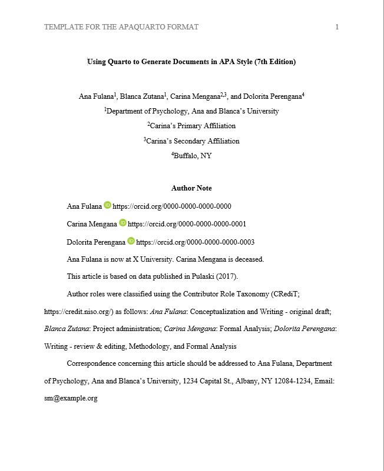
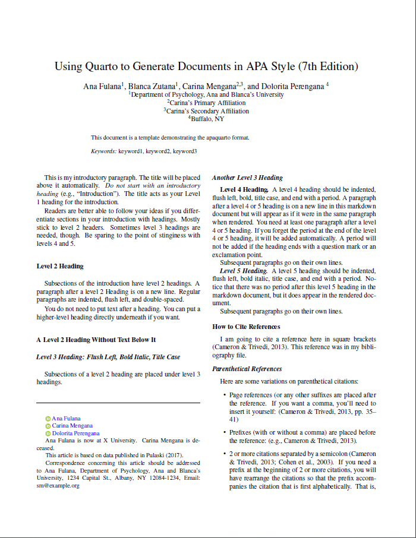

# A Quarto Extension for Creating APA 7 Style Documents


This article template creates [APA Style 7th Edition
documents](https://apastyle.apa.org/) in .docx, .html. and .pdf. The
.pdf format can be rendered via Latex (i.e., apaquarto-pdf) or via Typst
(apaquarto-typst). The Typst output for this extension is still
experimental and requires Quarto 1.5 or greater.

Because the .docx format is still widely used—and often required—my main
priority was to ensure compatibility for .docx. This is still a work in
progress, and I encourage filing a “New Issue” on GitHub if something
does not work of if there is a feature missing.

See [instructions and template options for apaquarto
here](https://wjschne.github.io/apaquarto/).

[Version History](https://wjschne.github.io/apaquarto/changelog.html)

## Example Outputs

The apaquarto-docx form looks like this:



The .html and .pdf output (in manuscript mode) look similar. The .pdf in
journal mode looks like this:



## Creating a New Article

You can create a new article with apaquarto’s template file. There are
two ways to do so.

1.  Via the R console
2.  Via the terminal

If you are an R user, you might prefer the R console method. Anyone,
including R users, can use the second method.

### Using R via the R Console

If you are an R user, you can install extensions with the [quarto
package](https://quarto-dev.github.io/quarto-r/) (version = 1.4 or
higher). The quarto package is not Quarto itself, but it provides
convenient functions to interact with Quarto.

If the quarto package is not installed, you can can install it by
running this code in the console:

``` r
# latest release version 
install.packages("quarto")
```

Once the quarto package is installed, you can install a quarto extension
template by setting your working directory to the folder where you want
the template to be installed (e.g., `setwd("path/to/my/folder")`) and
then running this:

``` r
quarto::quarto_use_template("wjschne/apaquarto")
```

A prompt will ask if you trust the author (me) not to run malicious
code. To proceed, answer `Yes` or just `Y`.

### Using the Terminal

If you are not an R user, you can create a new article directly in the
terminal. Navigate to the folder where you want to create your file
(e.g., `cd path/to/my/folder`), and run this command:

``` bash
quarto use template wjschne/apaquarto
```

In RStudio, the terminal is in a tab next to the console. If you cannot
see a terminal tab next to the console, use the keyboard shortcut
Alt-Shift-R to make a terminal appear.

Entering the command above will prompt a question about whether you
trust the author of the extension to not run malicious code. If you
answer Yes, you will be prompted to name a new folder where the
extension will be installed.

## Template file

After installation, you will see a template file in the folder you
select. The template file will have the same name as the folder you
installed the template to and ends with `.qmd`. This file has most of
the options already filled out and explains how and why to change them.
It also has a examples of how to use the extension in the text.

If you prefer a minimal template, you can start with the `minimal.qmd`
file instead.

## Adding apaquarto to an Existing Document or Project

You can add the apaquarto extension to an existing file or project in
one of two ways:

1.  Via the R console
2.  Via the terminal

### Creating a New Document Via the R console

If you are an R user, you can install extensions with the [quarto
package](https://quarto-dev.github.io/quarto-r/) (version = 1.4 or
higher). The quarto package is not Quarto itself, but it provides
convenient functions to interact with Quarto.

If the quarto package is not installed, you can can install it by
running this code in the console:

``` r
# latest release version 
install.packages("quarto")
```

In RStudio, open the project that contains the file to which you want to
add apaquarto. If your file is not part of a project, set the working
directory to the same folder as the file (e.g.,
`setwd("path/to/my/folder")`).

Run this code in the console:

``` r
quarto::quarto_use_template("wjschne/apaquarto")
```

### Creating a New Document Via the Terminal

To add this format to an existing document, navigate to the folder where
the existing .qmd you wish to use and then run:

``` bash
quarto add wjschne/apaquarto
```

### Add apaquarto to the Document’s Metadata:

You can select one of three formats: .docx, .pdf, or .html. When
writing, I prefer to output to .html, because it renders quickly. Then I
switch to .docx or .pdf, depending on where I need to submit the paper.

You can add all of these formats or any combination of them:

``` yaml
format:
  apaquarto-docx: default
  apaquarto-html: default
  apaquarto-pdf: default
  apaquarto-typst: default
```

Here is a minimal example of what the YAML metadata might look like:

``` yaml
---
title: "My Paper's Title: A Full Analysis of Everything"
shorttitle: "My Paper's Title"
author:
  - name: W. Joel Schneider
    corresponding: true
    orcid: 0000-0002-8393-5316
    email: schneider@temple.edu
    affiliations:
      - name: Temple University
        department: College of Education and Human Development
        address: 1301 Cecil B. Moore Ave.
        city: Philadelphia
        region: PA
        postal-code: 19122-6091
abstract: "This is my abstract."
keywords: [keyword1, keyword2]
author-note:
  disclosures:
    conflict of interest: The author has no conflict of interest to declare.
bibliography: mybibfile.bib     
format:
  apaquarto-docx: default
  apaquarto-html: default
  apaquarto-pdf: default
  apaquarto-typst: default
---
```

## Updating to the latest version of apaquarto

In the terminal, run

``` bash
quarto update wjschne/apaquarto
```

## Removing apaquarto

In the terminal, run

``` bash
quarto remove wjschne/apaquarto
```
