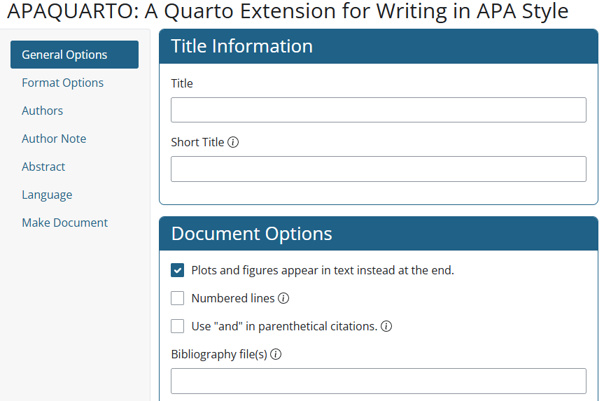
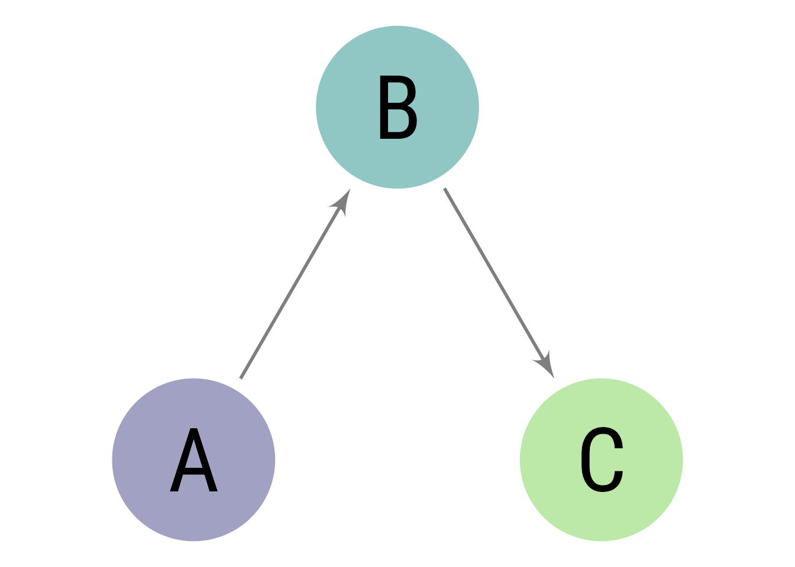
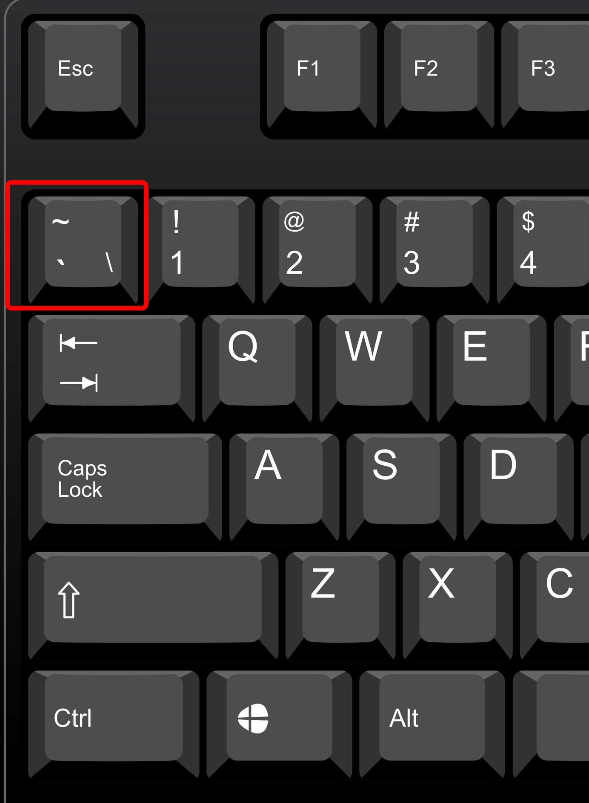

# Introduction

The body of the dissertation begins here, on a page of its own.

## Background

Some background.

## Deeper Knowledge

Cool stuff to know.

Block quotes are on their own line starting with the \> character. For example, @austenMansfieldPark1990 ['s] *Mansfield Park* has some memorable insights about the mind:

> If any one faculty of our nature may be called more wonderful than the rest, I do think it is memory. There seems something more speakingly incomprehensible in the powers, the failures, the inequalities of memory, than in any other of our intelligences. The memory is sometimes so retentive, so serviceable, so obedient; at others, so bewildered and so weak; and at others again, so tyrannic, so beyond control! We are, to be sure, a miracle every way; but our powers of recollecting and of forgetting do seem peculiarly past finding out. (p. 163)

# Literature Review

What others have found [@schneiderCattellHornCarrollTheoryCognitive2018].

{#ill-apashiny}

# Methods

Something about the method.

# Results

| Scale    | Description                    |
|:---------|:-------------------------------|
| Nominal  | Categories without an order    |
| Ordinal  | Ordered categories             |
| Interval | Quantities without a true zero |
| Ratio    | Quantities with a true zero    |

: Classic Scale Types. {#tbl-noir apa-note="My note"}

{#fig-appendfig apa-note="A *note* below the figure" fig-alt="A path diagram in which A causes B, and B causes C."}

# Discussion

## Figures and Illustrations

::: {#fig-example}

A figure caption that says what the figure shows.
:::

::: {#tbl-example}
| A | B |
|---|---|
| 1 | 2 |

A table caption that says what the table shows.
:::

::: {#ill-example apa-note="The backtick is sometimes called the grave accent symbol."}

The location of the backtick key on a standard keyboard.
:::

## Conclusion

This is the answer.

# References

::: {#refs}
:::

# Measures Used {#apx-measures}

The measures.

# Consent Forms {#apx-consent}

The forms.
