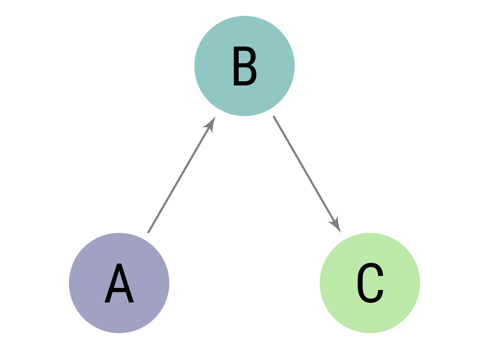

<!--
Reproducer for issue #158: rendering a figure made of multiple subfigures,
each carrying an APA-style `apa-note`, crashed the apaquarto-pdf format with

    Block, list of Blocks, or compatible element expected, got table
    ...apaquarto/apafloatlatex.lua:254: in local 'filter_fn'

and, once that crash was fixed, produced illegal nested LaTeX `figure`
environments ("Not in outer par mode").

Render from the repository root (so `_extensions/` and `sampleimage.png`
resolve), e.g. by copying this file next to `example.qmd`:

    cp tests/issue-158-subfigure-notes.qmd ./_issue158.qmd
    quarto render _issue158.qmd --to apaquarto-pdf

A successful run produces a PDF in which every figure note below is visible,
every figure cross-reference resolves (no "Figure ??"), and no LaTeX
"Not in outer par mode" error is raised.
-->

# 1. Single figure with a note (control)

A lone figure with `apa-note` already worked; it must keep working
(@fig-single).

{#fig-single width="2in"
apa-note="This note belongs to a single, non-subfigure figure."}

# 2. Subfigures, each with a note -- exactly as reported (the bug)

This block matches the minimal example in issue #158: a subfigure layout with
no overall caption, where each panel carries its own `apa-note`. Before the fix
it crashed the PDF render (@fig-bug).

::: {#fig-bug layout-ncol=2}
{#fig-bug-a width="2in"
apa-note="Note for the first panel."}

{#fig-bug-b width="2in"
apa-note="Note for the second panel."}
:::

# 3. Subfigures with a note and an overall caption

The same situation but with an overall figure caption (@fig-capnotes).

::: {#fig-capnotes layout-ncol=2}
{#fig-capnotes-a width="2in"
apa-note="Note for the first panel."}

{#fig-capnotes-b width="2in"
apa-note="Note for the second panel."}

An overall caption for the whole figure.
:::

# 4. Subfigures where only one panel has a note (mixed)

Only the second panel has a note; the first must render without one
(@fig-mixed).

::: {#fig-mixed layout-ncol=2}
{#fig-mixed-a width="2in"}

{#fig-mixed-b width="2in"
apa-note="Only this panel has a note."}

An overall caption for the mixed figure.
:::

# 5. A table with a note (untouched Table path)

The table branch of the filter is unchanged; confirm it still works
(@tbl-note).

| Group | Value |
|-------|-------|
| A     | 1     |
| B     | 2     |

: A small table. {#tbl-note apa-note="This note belongs to the table."}

Some text after the floats to confirm the document rendered completely.
