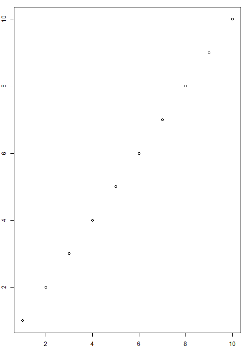

<!--
wjschne/apaquarto#171. Measured, not read: a figure and its note too tall
together for one page do not lose the end of the note. The note begins on
the page with its figure and runs on to the next, its last line a blank
line above the paragraph that follows it, as under any figure.

The figure was one box that could not break -- an [H] float in the .pdf,
an unbreakable block in typst -- and its note inside it, so the end of the
note was set past the foot of the page and cut off, with the render
reporting nothing. Now the .pdf sets a figure asked to stay in place in the
text flow, and typst lets a figure break; in both the number, caption and
picture stay together and with the first line of the note.

The last case is the other side of it: a short note at the foot of a page
stays with its figure, the figure going over to the next page whole when the
two do not fit. Nothing is measured across a picture, whose height a graphics
device sets a point or two differently from one machine to the next.
-->

Beforeone line of the body.

```{r}
#| label: fig-chunktall
#| fig-cap: "Chunkcap caption"
#| fig-width: 5
#| fig-height: 7
#| apa-note: "Chunk sentence 1 of a note too long to finish on the page its figure begins on. Chunk sentence 2 of a note too long to finish on the page its figure begins on. Chunk sentence 3 of a note too long to finish on the page its figure begins on. Chunk sentence 4 of a note too long to finish on the page its figure begins on. Chunk sentence 5 of a note too long to finish on the page its figure begins on. Chunk sentence 6 of a note too long to finish on the page its figure begins on. Chunk sentence 7 of a note too long to finish on the page its figure begins on. Chunk sentence 8 of a note too long to finish on the page its figure begins on. Chunk sentence 9 of a note too long to finish on the page its figure begins on. Chunk sentence 10 of a note too long to finish on the page its figure begins on. Chunk sentence 11 of a note too long to finish on the page its figure begins on. Chunkend words."
par(mar = c(2, 2, 1, 1))
plot(1:10)
```

Afterone line of the body.



{#fig-mdtall height="7in" apa-note="Markdown sentence 1 of a note too long to finish on the page its figure begins on. Markdown sentence 2 of a note too long to finish on the page its figure begins on. Markdown sentence 3 of a note too long to finish on the page its figure begins on. Markdown sentence 4 of a note too long to finish on the page its figure begins on. Markdown sentence 5 of a note too long to finish on the page its figure begins on. Markdown sentence 6 of a note too long to finish on the page its figure begins on. Markdown sentence 7 of a note too long to finish on the page its figure begins on. Markdown sentence 8 of a note too long to finish on the page its figure begins on. Markdown sentence 9 of a note too long to finish on the page its figure begins on. Markdown sentence 10 of a note too long to finish on the page its figure begins on. Markdown sentence 11 of a note too long to finish on the page its figure begins on. Mdend words."}

Aftertwo line of the body.



A line of filler.

A line of filler.

A line of filler.

A line of filler.

A line of filler.

A line of filler.

A line of filler.

A line of filler.

A line of filler.

A line of filler.

A line of filler.

A line of filler.

A line of filler.

A line of filler.

A line of filler.

A line of filler.

A line of filler.

A line of filler.

A line of filler.

```{r}
#| label: fig-keep
#| fig-cap: "Keepcap caption"
#| apa-note: "Keepnote words."
#| out-width: 2in
knitr::include_graphics("sampleimage.png")
```

Afterthree line of the body.
